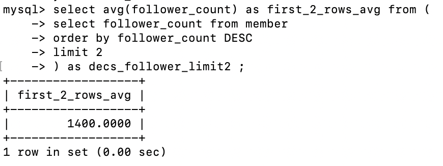

## Task 2: Create database and table in your MySQL server
### 👉🏽 2-1 Create a new database named website.
```sql
create database website;
```


---

### 👉🏽 2-2 Create a new table named member, in the website database, designed as below
```sql
create table member(
    id bigint primary key auto_increment,
    name varchar(255) not null,
    username varchar(255) not null,
    password varchar(255) not null,
    follower_count int unsigned not null default 0,
    time datetime not null default current_timestamp
);
```


## Task 3: SQL CRUD
### 👉🏽 3-1 INSERT a new row to the member table where name, username and password must be set to test. INSERT additional 4 rows with arbitrary data.
```sql
insert into member (name,username,password,follower_count) values ('test','test','test',200);
insert into member (name,username,password,follower_count) values ('麥當勞唯一信仰','mydondon','mydondon',1300);
insert into member (name,username,password,follower_count) values ('肯爺爺老當益壯','KFC_stillyoung','KFC_stillyoung',800);
insert into member (name,username,password,follower_count) values ('摩斯高質感代表','mosburger_love','mosburger_love',1500);
insert into member (name,username,password,follower_count) values ('漢堡王火烤美味','onfire_king','onfire_king',500);
```


---

### 👉🏽 3-2 SELECT all rows from the member table.
```sql
select * from member;
```


---

### 👉🏽 3-3 SELECT all rows from the member table, in descending order of time.
```sql
select * from member
order by time DESC;
```


---

### 👉🏽 3-4 SELECT total 3 rows, second to fourth, from the member table, in descending order of time. Note: it does not mean SELECT rows where id are 2, 3, or 4.

```sql
select * from member 
order by time DESC 
limit 1,3;
```


---

### 👉🏽 3-5 SELECT rows where username equals to test.
```sql
select * from member 
where username='test';
```


---

### 👉🏽 3-6 SELECT rows where name includes the es keyword.
```sql
select * from member 
where name like '%es%';
```


---

### 👉🏽 3-7 SELECT rows where both username and password equal to test.
```sql
select * from member 
where username='test' and password='test';
```


---

### 👉🏽 3-8 UPDATE data in name column to test2 where username equals to test.
```sql
update member set name='test2' where username='test';
select * from member;
```


## Task 4: SQL Aggregation Functions
### 👉🏽 4-1 SELECT how many rows from the member table.
```sql
select count(id) from member;
```


---

### 👉🏽 4-2 SELECT the sum of follower_count of all the rows from the member table.
```sql
select sum(follower_count) from member;
```


---

### 👉🏽 4-3 SELECT the average of follower_count of all the rows from the member table.
```sql
select avg(follower_count) from member;
```


---

### 👉🏽 4-4 SELECT the average of follower_count of the first 2 rows, in descending order of follower_count, from the member table.
```sql
select avg(follower_count) as first_2_rows_avg from (
    select follower_count from member 
    order by follower_count DESC 
    limit 2
) as decs_follower_limit2 ;
```




## Task 5: SQL JOIN
### 👉🏽 5-1 Create a new table named message, in the website database. designed as below
```sql
create table message(
        id bigint primary key auto_increment,
        member_id bigint not null,
        content varchar(255) not null,
        like_count int unsigned not null default 0,
        time datetime not null default current_timestamp,
        foreign key(member_id)
        references member(id)
);
```


```sql
insert into message (member_id,content,like_count) values (4,"摩斯首推吉士漢堡耶耶！",10);
insert into message (member_id,content,like_count) values (5,"大家一起分享最帶感的火烤！",3);
insert into message (member_id,content,like_count) values (1,"testtesttset",28);
insert into message (member_id,content,like_count) values (2,"麥當勞就是我的靈魂伴侶啊啊！",100);
insert into message (member_id,content,like_count) values (3,"肯德基才不是被炸雞耽誤的蛋塔店！",55);
```


---

### 👉🏽 5-2 SELECT all messages, including sender names. We have to JOIN the member table to get that.
```sql
select * from message inner join member on message.member_id=member.id;
```


---

### 👉🏽 5-3 SELECT all messages, including sender names, where sender username equals to test. We have to JOIN the member table to filter and get that.
```sql
select * from message inner join member on message.member_id=member.id where member.username='test';
```


---

### 👉🏽 5-4 Use SELECT, SQL Aggregation Functions with JOIN statement, get the average like count of messages where sender username equals to test.
為了更有效果，在求平均前，先多加了一筆username為test的人的message
```sql
insert into message (member_id,content,like_count) values (1,"測試的人寫的測試內容",22);
```


<br/>

```sql
select avg(message.like_count) from message inner join member on message.member_id=member.id where member.username='test';
```


---

### 👉🏽 5-5 Use SELECT, SQL Aggregation Functions with JOIN statement, get the average like count of messages GROUP BY sender username.
```sql
select member.username,avg(message.like_count) from message inner join member on message.member_id=member.id group by member.username;
```

